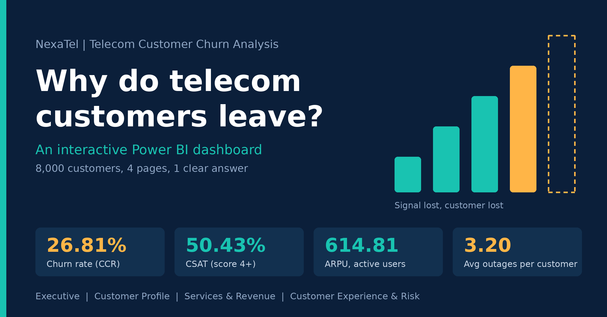

# NexaTel Telecom Customer Churn | Power BI Dashboard

An interactive Power BI dashboard that explains why telecom customers leave
and which customer groups are most at risk. Built end to end: Power Query,
Star Schema, DAX measures, and a 4-page report with cross-filtering.

## Business questions
- How many customers do we lose, and where (region, segment)?
- Do outages, complaints, and low satisfaction drive churn?
- Which contracts, tenure bands, and price bands carry the most risk?

## Dashboard pages
| Page | What it answers |
| --- | --- |
| Executive | Overall churn, monthly trend, region and segment, churn reasons |
| Customer Profile | Who churns: contract type, tenure band, price band |
| Services & Revenue | Services, ARPU, and revenue at risk |
| Customer Experience & Risk | Satisfaction, complaints, outages, tech support |

## Key KPIs
| KPI | Definition |
| --- | --- |
| Active Base | Customers with ChurnStatus = Active |
| Churned | Customers with ChurnStatus = Churned |
| CCR (Customer Churn Rate) | Churned / total customers |
| CRR (Customer Retention Rate) | 1 - CCR |
| ARPU | Average MonthlyCharges of active customers |
| CSAT | Customers with SatisfactionScore >= 4 / all customers |
| Complaints per 100 | Total ComplaintsLast12M / customers x 100 |
| Avg Outages | Average ServiceOutagesLast12M |
| Avg Tenure | Average TenureMonths (months) |

## Results
- 8,000 customers: 5,855 active and 2,145 churned
- Churn rate (CCR): **26.81%**, retention (CRR): **73.19%**
- CSAT: **50.43%**
- ARPU: **614.81**
- Avg outages: **3.20**, avg support calls: **2.54**

## Key insights
- **New customers leave first:** CCR is about 54% at 0-6 months of tenure vs about 9% after 48 months.
- **Contracts matter:** month-to-month is about 36% vs about 10% on two-year contracts.
- **Support is the warning sign:** CCR climbs from about 19% with 0 support calls to about 70% at 11+ calls. Poor customer support is also the top churn reason.
- **Outages hurt:** about 40% CCR at 6+ outages vs about 17% with none.
- **Unhappy customers leave:** about 58% CCR at satisfaction 1 vs about 11% at satisfaction 5.
- **Price and service:** the 900+ price band (about 35%) and Fiber Optic (about 33%) churn most.
- **Where:** Greater Cairo loses the most customers; Luxor has the highest city CCR (about 33%).

## Visuals used
Cards, line chart (churn trend), column and bar charts, scatter charts
(outages vs CCR, ARPU vs CCR). Full list in `PowerBI_Visuals_and_Data_Used.docx`.

## Workflow
1. **Power Query:** clean data, fix types, create bands (tenure, price, complaints)
2. **Modeling:** Star Schema with fact and dimension tables
3. **DAX:** KPI measures (CCR, CRR, ARPU, CSAT) and segmentation
4. **Visualization:** 4 interactive pages with cross-filtering

## Files
- `telecom_chrunk.pbix`: the Power BI report
- `PowerBI_Visuals_and_Data_Used.docx`: visuals and fields per page
- `NexaTel_Churn_Cover.png`: cover image

## Tools
Power BI Desktop, Power Query, DAX

## Author
[Your name] | [LinkedIn link]
